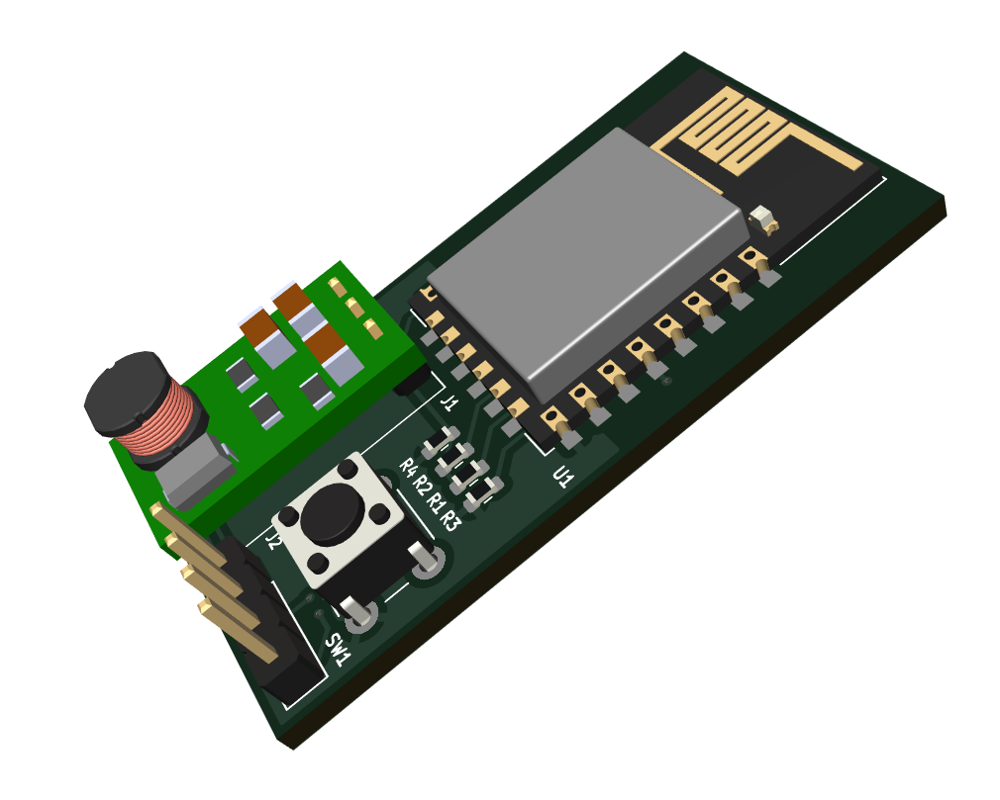
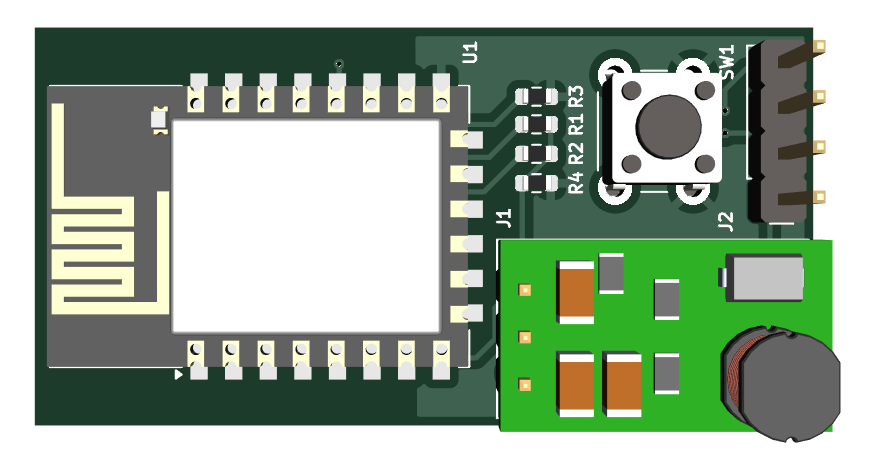
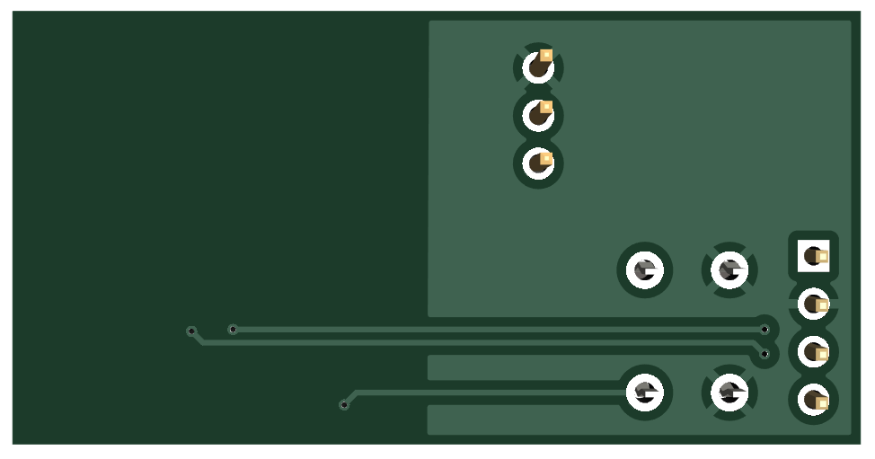

# AcFreedom To EspHome
Use ESPhome to have free access to Ac's without using the Acfreedom application. Use ESPhome plus Mqtt and homeassistant.

This project is just a simple hardware adapter to use with the project: [esphome_aux_ac_component](https://github.com/GrKoR/esphome_aux_ac_component)

Pictures
-------------------

